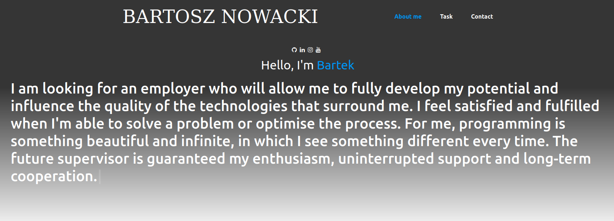

# task1

## https://showmeatask.herokuapp.com/

<br>

# General info


<br>



<br>

## Table of contents

- [General info](#general-info)
- [Technologies](#technologies)
- [Setup](#setup)
- [Features](#features))
- [Project Status](#ProjectS)

  <br>
  <br>

# Technologies:

- JavaScript
- SASS

<br>

<br>

# Setup

To run this project:

```
$ open live server

```

# Features


<br>


<br>

# Project Status

Project is _complete_


