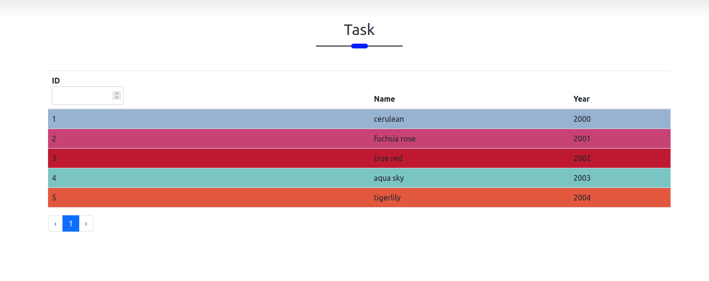

# task1

## https://showmeatask.herokuapp.com/

<br>

# General info

Task for an interview. I wanted to be creative and add something to impress recruiters (part About Me).

I lost the instructions task, but it was something like this:

- Create table
- Add pagination
- Create 'search inputo'
- 5 items per page
- In order of year

<br>



<br>

## Table of contents

- [General info](#general-info)
- [Technologies](#technologies)
- [Setup](#setup)
- [Features](#features)
- [Project Status](#Projects)

  <br>
  <br>

# Technologies:

- React
- Redux
- Bootstrap
- API
- Heroku

<br>

<br>

# Setup

To run this project, install it locally using npm:

```
$ npm install
$ npm start
```

# Features

- part About Me 

</br>

- Smooth Scrolling and Fade In Animation
</br>
- Fancy social-media button
  
</br>

- Items of array from API
 ![home](./img/arr.png
</br>
- Implemented Email functionality using node mailer.


<br>

<br>

# Project Status

Project is _complete_
